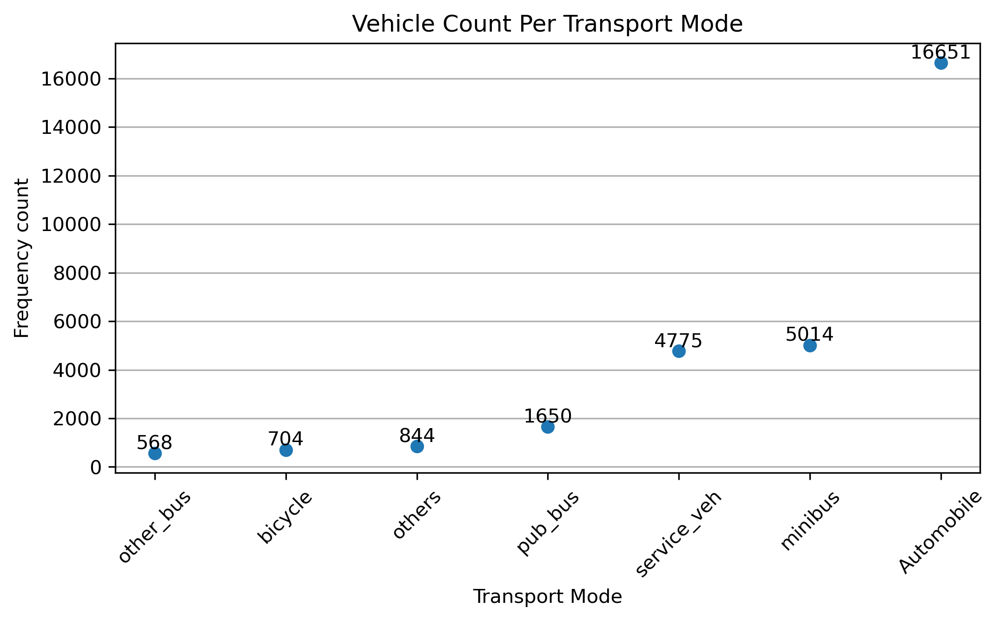
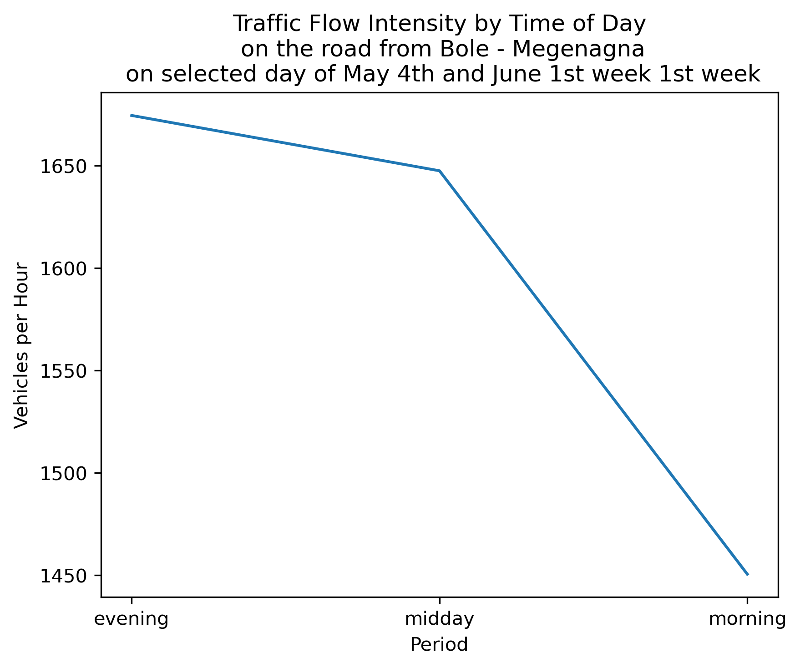

# Bole Ring Road Traffic Analysis

## Overview
This project analyzes traffic flow based on field survey data collected at a fixed point along Bole Ring Road, Addis Ababa.

## Study Area
Bole Ring Road, Addis Ababa, Ethiopia (GPS: 8.983220, 38.780600)

## Objectives
- Analyze vehicle flow by type
- Identify peak traffic periods
- Estimate passenger movement
- Visualize traffic patterns

## Methods
- Data collection from field survey
- Data cleaning using Python (pandas)
- Time grouping (morning, midday, evening)
- Vehicle classification analysis
- Visualization using matplotlib

## Tools
- Python
- pandas
- matplotlib
- numpy

## Key Outputs
- Vehicle count bar charts
- Passenger estimation charts
- Time-based traffic summaries

## Results and Visualizations

### 1. Vehicle Count by Type

### 2. Estimated Passenger Flow

### 3. Traffic Pattern by Time Period

